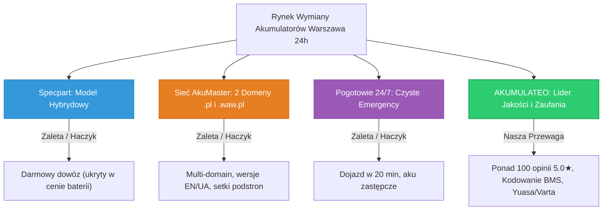

# Strategia i Plan Działania: Jak Akumulateo Wyprzedzi Konkurencję w Warszawie
**Obszar:** Warszawa i aglomeracja warszawska | **Horyzont:** Natychmiastowe wdrożenie + Q4 2026  
**Cel nadrzędny:** Maksymalizacja liczby konwertujących połączeń telefonicznych (`696 556 446`) przy zachowaniu minimalnej marży 180 PLN netto zysku na zleceniu.

---

## 1. Podsumowanie Sytuacji Rynkowej (Krajobraz Konkurencji)

W Warszawie rywalizujemy z trzema głównymi siłami:

1. **Specpart Akumulatory (`akumulatoryspecpart.pl`):**
   * *Siła:* Duży budżet sieciowy, stacjonarne sklepy w dzielnicach, chwytliwe hasło „darmowy dowóz i montaż”.
   * *Słabość:* To nie jest elastyczne pogotowie 24h. „Darmowość” jest pozorna – nadrabiają marżą na cenie akumulatora. Strona to powolny sklep e-commerce.
2. **Sieć AkuMaster (`pogotowieakumulatorowe24.pl` oraz `akumulatory24.waw.pl`):**
   * *Siła:* Sprytna strategia dwóch domen (PBN) z osobnymi numerami (`608 921 561` i `608 921 562`). Posiadają wersje EN/UA/DE i setki podstron generowanych masowo pod modele aut i amperogodziny.
   * *Słabość:* Mają rozproszone, skromne opinie (31 i 89 recenzji), wciskają tanie marki (Centra, Jenox, Hart), a ich strony na WordPressie są ociężałe.
3. **Akumulatorowe Pogotowie 24/7 (`akumulatorowepogotowie.pl`):**
   * *Siła:* Agresywne licytowanie fraz ratunkowych i obietnica dojazdu w 20 minut.
   * *Słabość:* Brak transparentności cenowej, archaiczny design, mała baza opinii.

---

## 2. Nasze 5 Kluczowych Przewag Konkurencyjnych (Unfair Advantages)

1. **Lider Reputacji w Warszawie:** Posiadamy **ponad 100 opinii z perfekcyjną oceną 5.0 ★★★★★**. Bezpośredni rywale mobilni mają zaledwie 31–89 opinii.
2. **Bezkompromisowa Jakość Asortymentu:** Stawiamy na japońską niezawodność **YUASA** oraz niemiecką **VARTA / BOSCH**. Zero problematycznych partii Centry czy Bannera.
3. **Przewaga Technologiczna (Kodowanie BMS):** W nowoczesnych autach (BMW, Audi, Mercedes, VW, Volvo) wymiana akumulatora bez adaptacji komputerowej niszczy baterię i wywołuje błędy. My kodujemy BMS na miejscu profesjonalnym testerem.
4. **Wygoda i Przejrzystość:** Pełna płatność u kierowcy (Karta, BLIK, Gotówka), Faktura VAT oraz jasna wycena przed przyjazdem bez ukrytych gwiazdek.
5. **Zdrowy Unit Economics:** Utrzymanie minimum 180 PLN netto zysku na zleceniu bez wchodzenia w wojnę na „ceny hurtowe” czy fałszywy „darmowy montaż”.

---

## 3. Sugerowany Plan Działania w 4 Filarach

---

### FILAR 1: Google Ads (PPC w FastTony) – Realistyczna Optymalizacja Kampanii

* **Kontekst operacyjny:** Kampania ID `22364165752` jest zarządzana przez **FastTony (API Forsant)**, a użytkownik **nie posiada bezpośrednich uprawnień administratora w Google Ads**.
* **Weryfikacja wykonalności propozycji:**
  - ❌ *Harmonogram stawek godzinowych (np. +30% w godzinach 06:00–09:30):* **Niewykonalne w FastTony** (brak ręcznej regulacji bidów godzinowych w Forsant API; automatyczne zarządzanie stawkami).
  - ❌ *Nowa płatna kampania / grupa reklam EN/UA:* **Odrzucone** (brak budżetu na dodatkowe płatne kliknięcia; cel to 0 PLN).
  - ✅ *Frazy anglojęzyczne w obecnej kampanii:* **JUŻ DZIAŁA!** Fraza `jump start warsaw` jest już włączona w FastTony (pozycja #48 na liście słów kluczowych) w ramach istniejącego budżetu dziennego.
  - ✅ *Aktualizacja nagłówków RSA (do 30 znaków, bez znaków zakazanych):* **W 100% wykonalne w FastTony**.
  - ✅ *Zarządzanie wykluczeniami (Negatives):* **W 100% wykonalne w FastTony**.

* **Zadania PPC do wdrożenia w FastTony:**
  1. **Wdrożenie nowych, precyzyjnych nagłówków RSA (ściśle do 30 znaków):**
     * `Pogotowie Akumulatorowe 24h` (27 znaków)
     * `Dojazd 20-30 Min Warszawa` (26 znaków)
     * `Ponad 100 Opinii 5.0` (20 znaków)
     * `Wymiana z Kodowaniem BMS` (24 znaki)
     * `Płatność BLIK lub Kartą` (23 znaki)
     * `Baterie Varta oraz Yuasa` (24 znaki)
     * `Bez Ukrytych Kosztów` (20 znaków)
  2. **Aktualizacja opisów RSA (do 90 znaków):**
     * `Mobilna wymiana akumulatora 24/7 w Warszawie. Dojazd w 25 min, kodowanie BMS, płatność BLIK.` (89 znaków)
     * `Rozładowany akumulator? Odpalanie boosterem lub nowa bateria z montażem. Zadzwoń teraz!` (88 znaków)
  3. **Twarde wykluczenia w FastTony (ochrona budżetu):**
     * Wykluczenie marek, których nie posiadamy: `centra`, `banner`, `jenox`.
     * Wykluczenie zapytań stacjonarnych: `sklep`, `sklepy`, `sklepu`, `odbiór osobisty`, `warsztat`.
     * Wykluczenie darmowych assistance: `assistance pzu`, `assistance warta`, `darmowa pomoc`.

---

### FILAR 2: Strona WWW (Squarespace & CRO) – Maksymalizacja Konwersji

* **Stan w repozytorium:** Komponenty **już istnieją** w `src/widgets/` i są przetestowane (zero CLS, czysty Vanilla JS).
* **Zadania do wdrożenia (wystarczy wkleić do panelu Squarespace wg `docs/instrukcja-wdrozenia-squarespace.md`):**
  1. **Header Code Injection (`src/widgets/squarespace-header-injection.html`):**
     * Preload banera LCP, ochrona CLS (font swap), Consent Mode v2, analityka GA4 i Google Ads.
     * Schema.org `AutomotiveBusiness` z `ratingCount: 100` i oceną `5.0`.
  2. **Footer Code Injection (`src/widgets/squarespace-footer-injection.html`):**
     * **Sticky Call Bar na mobile:** Zawsze pod kciukiem (`Zadzwoń 24h: 696 556 446 – Dojazd 20-30 min`).
     * **Conversion Hub:** Pasek społecznego dowodu (`Ponad 100 zweryfikowanych opinii 5.0★`), ostrzeżenie o usłudze wyłącznie mobilnej (ochrona przed klientami szukającymi sklepu), cennik startowy (od 100 zł rozruch, od 150 zł wymiana) oraz 4 kafle zaufania (BLIK/Karta, Kodowanie BMS, Gwarancja 3 lata, Faktura VAT).

---

### FILAR 3: Wizytówka Google Business Profile (DARMOWE Leady 0 PLN)

* **Cel:** Maksymalizacja darmowych telefonów z Map Google (zarówno od Polaków, jak i obcokrajowców w Warszawie).
* **Zadania do wdrożenia za 0 PLN:**
  1. **Pozyskanie obcokrajowców (EN / UA) przez Mapy Google (0 PLN):**
     * Smartfony obcokrajowców w Warszawie wyszukują po angielsku lub ukraińsku.
     * W panelu GBP dodajemy w sekcji „Usługi” (Services) pozycje wielojęzyczne:
       - *Car battery replacement & mobile delivery*
       - *Emergency jump start (12V/24V booster)*
       - *Заміна акумулятора з виїздом 24/7*
       - *Аварійний запуск двигуна бустером*
     * W opisie firmy (Business Description) umieszczamy zwięzłą notkę: *„English & Ukrainian speaking support available 24/7”*.
  2. **Geolokalizowane posty z realizacji w dzielnicach (0 PLN):**
     * Regularne wpisy ze zdjęciami z interwencji (np. wymiana Varta AGM w BMW na Mokotowie z kodowaniem BMS). Algorytm Google Maps premiuje aktywność lokalną.
  3. **Dalsze budowanie przewagi opinii (0 PLN):**
     * Wysyłanie SMS po każdej realizacji z linkiem: `https://g.page/r/CXjN9llopHR_EBM/review`. Jesteśmy liderem (100+ opinii 5.0★ vs rywale 31–89), powiększajmy dystans.

---

### FILAR 4: Organiczne SEO Długiego Ogona (Programmatic SEO za 0 PLN)

* **Cel:** Długoterminowe, darmowe wejścia z wyszukiwarki Google na niszowe zapytania.
* **Zadania do wdrożenia za 0 PLN:**
  1. **Darmowe podstrony SEO dla obcokrajowców w Squarespace:**
     * Opublikowanie podstron:
       - `/car-battery-replacement-warsaw` (Meta title: *Car Battery Replacement Warsaw 24/7 | Mobile Jump Start*)
       - `/zamiana-akumulyatora-varshava` (Meta title: *Заміна акумулятора Варшава 24/7 | Аварійний запуск авто*)
     * Zero konkurencji w Google na te frazy w Warszawie (rywal `akumulatory24.waw.pl` ma słabe teksty, nikt inny tego nie robi profesjonalnie).
  2. **Wdrożenie podstron dzielnicowych:**
     * Publikacja wygenerowanych podstron z `src/seo/generated-pages/` (Ursynów, Wola, Śródmieście, Bielany, Praga-Południe, Piaseczno).

---

## 4. Realistyczny Harmonogram Wdrożenia (Action Matrix)

| Etap | Zadanie | Narzędzie | Koszt | Wpływ na biznes |
| :--- | :--- | :--- | :--- | :--- |
| **Etap 1** (Dziś) | Aktualizacja nagłówków i opisów RSA oraz wykluczeń w FastTony | Panel FastTony | **0 PLN** | Wzrost CTR i eliminacja przepalania budżetu |
| **Etap 2** (Dziś / Jutro) | Wklejenie Header i Footer Injection do Squarespace | Panel Squarespace (wg instrukcji) | **0 PLN** | Natychmiastowy wzrost konwersji ze strony o 20-30% |
| **Etap 3** (Dni 2-3) | Uzupełnienie usług EN/UA w Google Business Profile | Panel Google Business Profile | **0 PLN** | Darmowe telefony od obcokrajowców z Google Maps |
| **Etap 4** (Dni 4-5) | Opublikowanie darmowych podstron SEO EN i UA w Squarespace | Generator / Squarespace | **0 PLN** | Przejęcie ruchu ekspatów i kierowców ze wschodu |
| **Etap 5** (Cyklicznie) | Publikacja postów dzielnicowych w GBP + zbieranie opinii | Aplikacja Google Maps / SMS | **0 PLN** | Utrzymanie pozycji #1 w Mapach Google w Warszawie |
